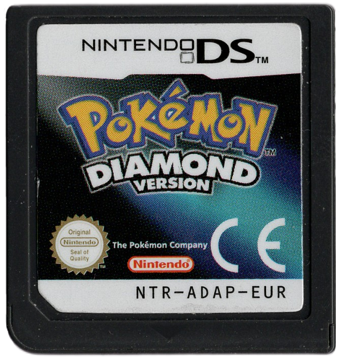

# Is your Nintendo DS Cartridge Counterfeit?

A comprehensive guide on checking or verifying if a Nintendo DS cartridge is real/legit or counterfeit/fake.
I made this specifically due to the fragmented and often old and outdated information, since this is on hosted on GitHub, other kind people can always create a new issue topic, or discuss tips and tricks, or even help me spare time with creating a pull request with changes, allowing this document to stay up to date. Make sure you always share the page link ([rlaphoenix.github.io/IsMyNDSCartFake](https://rlaphoenix.github.io/IsMyNDSCartFake)), and not a download or export of this information.

I recommend verifying the information in the order shown for swiftness, the more down the list you go the harder or more time consuming stuff get's to verify.

Below I explain the expected look, format, positioning, or values of a real cartridge. If any single thing doesn't match up as expected, unless specified, it's a fake.

## Don't have the cartridge yet? looking to buy one? Nice job not pirating, here's some tips

### Weird chinese stickers on the cartridge edges

If you spot this, do not purchase it. That is usually done to hide stuff like the rounded edges (though not in this specific case, but I have seen it be done) and is always hiding the microSD card on the top left (that it loads the pirated ROM from). These are definitely fake. The original sellers of these cartridges in shady marketplaces even tend to deny "warrenty" or refunds if you remove the sticker.

## The cartridge shell/plastic

### Real:

> Left (front): Pokémon Diamond Version (ADAP, EUR-UK specific)  
> Right (back): Pokémon Ranger: Guardian Signs (B3RJ, JPN specific)

### Fake example:

> This is just one example of a fake cartridge shell. I'm showing this one as an example as it has all the tell tale signs of a fake.

### Signs of a fake/reproduction shell:

- Sides or Top Rounded or dented inwards.
- The "Ribs" (yes thats what the patent officially calls them) that cover the contacts on the bottom only has 2 ribs (cost saving measure), there should be ribs between every contact.
- Hole on the top or a microSD card logo anywhere on it.
- A Oval shape embossed on the back with or without anything written or stuck onto it. This is space for a "Verify Me" sticker that has a code and usually some bs shines or whatever, this is to trick people into going to a website to have the website say its a real cartridge (when it isn't, this isn't a thing nintendo has EVER done)...

## Ok, let's move on to verifying the information of the cartridge

### 1. Sticker Code

#### Format

`XXX-XXXX-XXX` (12 characters long, including the dashes).
More specifically, the format is `SYSTEMID-GAMEID-REGION`.

`NOT FOR RESALE` cartridges have the same format.  
Some Demo cartridges have the same format, but also has `DIS-` at the start.

> SYSTEMID: `NTR` for most games, or `TWL` for DSi Enhances or Exclusive games.

> GAMEID: Four characters of uppercase-only alphanumeric. This isn't unique to every cartridge, but it's unique to every game.

> REGION: This is an uppercase Alpha 3 (Three letter) region name, e.g. `JPN`, `USA`, `EUR`, `AUS`.

#### Verifying

1. Take the `GAMEID` and put it at the end of `https://www.gametdb.com/DS/`, e.g. `https://www.gametdb.com/DS/ADAE` (Pokemon Diamond USA) and see if the game information it brings up is the right game, the right cover (if available), and the right region and language. **If it says "The page "DS/YOUR_GAMEID" doesn't exist.", it might not be on gametdb, instead do some google searches and make sure you find lot's of results and not just ones from ebay. Stuff like Gamespot or datomatic.no-intro.org results are reputable.**
2. The `GAMEID` should be the first four characters of the Cartridge Serial explained below.

---

### 2. Shell's Cartridge Serial

#### Format

`XXXXXXXXX` (9 characters long).
More specifically, the format is `GAMEIDXXXXX`.

The fifth character seems to always be `N`, possibly `N` for `NTR`/`Nintendo`. The sixth character I have seen be `0` and `5`, It's very possible this is a region specifier.

It's printed with some kind of ink, it's not engraved like the rest of the text on the back of the cartridge.
In fact it fades very easily, even over time on it's own. I opened a sealed copy of a 2007 game in 2019 (which is an oof btw) and it has a barely readable serial, it's harder to see than the other text on the cartridge even!

The ink seems to be a deep black. Though even some real cartridges I have look more like gray due to the fading it has had, but I will say even barely faded fakes are VERY gray. Put your best judgement here.

#### Verifying

1. The first four characters should match the `GAMEID` from the Sticker Code.

---

### 3. The visible exposed PCB

#### Format

I don't know the format, but from looking at my various games, it seems to be "▼&nbsp;XX&nbsp;&nbsp;X-X&nbsp;&nbsp;XXX-XX" where each character is within each rib, including the spaces.
The first "XX" after "▼" isn't always two characters, sometimes only one. Other than that I have no idea what the characters represent and could just be manufacturing batch information.

The color of the PCB should be Green, with no visible test pads, traces or anything other than the contact pads that the Nintendo DS system will read. I can't give an accurate color value as it all really comes down to lighting conditions as well as scanner differences, but generally speaking its a somewhat darker green, fairly basic green, you could take a look at the various real images I've used throughout this document as a rough estimate.

The blank bits under the contacts (where most of the contacts have less height), the color of that area is a very dark yellow or very dark swamp-green color.

---

### 4. Shell's Component Information Text

#### Format

"COMPID&nbsp;&nbsp;PAT.&nbsp;PEND." (16 characters long excluding spaces).

> COMPID: This is the Component ID, the SKU of the base cartridge. It should be "NTR-005" for almost every single cartridge. It will be "NTR-031." (yes, with the .) for cartridges that are deep black that use infrared technology as an anti-piracy measure.

#### Verifying

1. The spacing between COMPID and `PAT.` should be slightly bigger than the spacing between `PAT.` and `PEND.`.
2. It should be slightly embossed with a somewhat glossier tone than the shell, it should match the Nintendo Logo's color, glossy tone, and emboss.
3. The font is very often wrong on fake cartridges and it's quite simple to spot. Pay attention to `N`s, `T`s, `R`s, and `.`s.
4. The `.`s should be a tiny perfect circle shape, fake's often have it as a square dot/pixel shape.

#### Real vs Fake Example

> This is a side by side (same lighting condition) example. Notice how the spacing is off, the font is different, and how it's way more embossed and darker than the real one, as well as the general colors not matching.

---

### 5. Shell's Nintendo Logo

#### Verifying

1. It should be slightly embossed with a somewhat glossier tone than the shell, it should match the Component Information text's color, glossy tone, and emboss.
2. It's fairly difficult to tell, but the overall comfy spacing around the text should be the same all around it. What I mean is, the fake's typically have very little spacing between the outline and the text on the top and bottom making it feel more cramped.
3. Pay attention to the font, especially the lowercase `n`s, the `e`s, and the `o`'s, the real one has the line thickness near the top and bottom of curved to be very thin, but thick on the sides.
4. Pay very close attention to the dot of the i, it should be noticably square shaped. While you're checking that, look at the top right of the `o`, there should be a dot there to represent the &trade; symbol and it should be a perfect circle shape.

#### Real vs Fake Example

> This is a side by side (same lighting condition) example. Notice how the spacing around the text but inside the outline is off, the font is different, and how it's way more embossed and darker than the real one. Also notice how the line thickness near the top and bottom characters is very thin on the original, but isn't on the fake, its just a linear thickness.

## Ok, but is there anything I should look for with a specific game?

Yes actually! But the following isn't even close to a comprehensive list of possibilities, though it does give a good idea what has been tried. Follow the above information first, and then read the game-specific notes.

### Pokemon HeartGold and SoulSilver Version

These game's tried a very nice trick to anti-piracy which helps verify it as a legitimate or not cartridge (it also helps tremendously against fake cartridges).

The cartridge shell's color is a dark black rather than a dark gray that most shells are. Why Black? The cartridge uses infrared technology inside as a way to see if the ROM is being played from an actual cartridge or from a flash card. Infrared light caused it to be quite noticable and annoying so they changed it to a darker black to block light much more.

Don't know if your cartridge is dark black or dark gray? Colorblind? NO PROBLEM! The back of the cartridge will display "NTR-031. PAT. PEND." rather than the usual "NTR-005 PAT. PEND.". Not only that, but if you put a very strong light in the front of the cartridge, you should see a purple-ish glow and transparency to the shell.

---

### Have some nice information? Did I miss something? Feel free to make a [GitHub Issue](https://github.com/rlaPHOENiX/IsMyNDSCartFake/issues) explaining, or perhaps even push a Pull Request.
